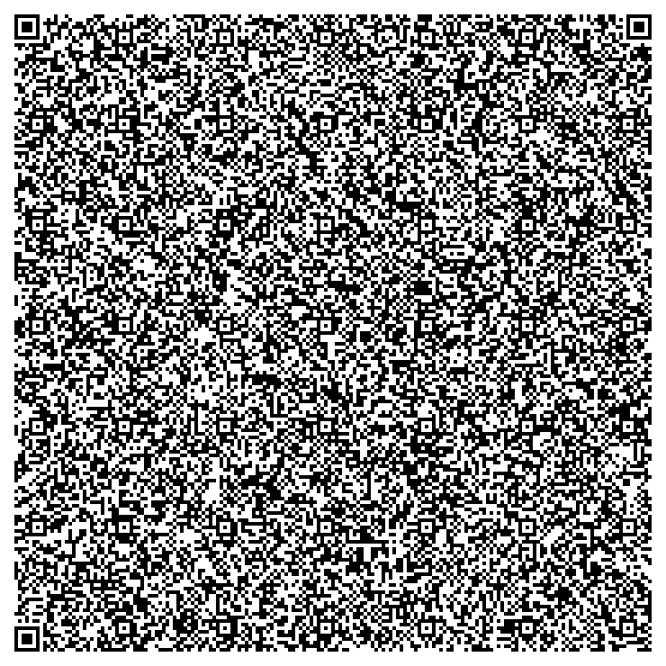

# 📦 QR-Server: A Full Web Server Inside a QR Code

> *Overengineering is not just a habit; it's a lifestyle.* Welcome to the peak of Jank Engineering.


This project is a fully functional, zero-dependency Linux web server written entirely in x86_64 Assembly. It serves a Brotli-compressed, interactive HTML portfolio (featuring CSS, GSAP animations, and custom fonts), all meticulously golfed and squeezed into a single **Version 40 QR Code** (under 2953 bytes).

No Node.js, no Python, no bloat. Just pure machine code and aggressive sizecoding.

---
## 👁️ The Result
<p align="center">
  
  <br>
  <i>Yes, the entire web server and website are inside this image.</i>
</p>

---

## 🚀 Features

* **Microscopic Footprint:** The entire executable (ELF binary + HTTP headers + compressed HTML payload) weighs less than 3 KB.
* **Assembly Backend:** A custom HTTP/1.0 server written in raw x86_64 Assembly (`server.asm`), heavily optimized using 32-bit registers and stack tricks to bypass ELF bloat.
* **Built-in Brotli Compression:** The frontend payload is compressed at maximum level (`index.html.br`) and injected directly into the executable using the NASM `incbin` directive.
* **Fileless-ready:** Capable of being extracted and executed entirely in RAM.
* **Go Extractor Tool:** Includes a custom optical scanner built in Go (`extractor.go`) to safely extract the raw binary from the QR code without UTF-8 null-byte corruption.

---

## 🛠️ How It Works

1. **The Frontend:** A responsive portfolio (`index.html`) using HTML5 tricks, CSS clamping, and GSAP/Flip.js for CRT-style animations.
2. **The Squeeze:** The HTML is stripped of all conventional "best practices" (no doctype, no quotes, single-letter IDs) and crushed using Brotli (`--best`).
3. **The Metal:** The Assembly code opens a socket, binds to port `8080`, and writes the HTTP headers alongside the Brotli payload directly to the client.
4. **The Matrix:** The stripped ELF binary is fed into `qrencode` using 8-bit raw byte mode (`-8`) to generate `gambiarra_qr.png`.

---

## 📥 Quick Start (Extraction & Execution)

Don't have the source code? Just have the QR Code? No problem. 

### 1. Build the Extractor
To pull the binary out of the QR code safely, compile the provided Go tool:
```bash
go mod tidy
go build -o qr-extractor extractor.go
```

### 2. Resurrect the Server
Run the extractor against the QR code image. It will decode the matrix and forge the executable file:
```bash
./qr-extractor -in gambiarra_qr.png -out webserver_final
```

### 3. Run It
```bash
./webserver_final
```
Open your browser and navigate to `http://127.0.0.1:8080`. Welcome to the Matrix.

---

## 🔨 Building from Scratch (For the Brave)

If you want to modify the site or the server, you will need `nasm`, `brotli`, and `qrencode`.

1. **Compress the payload:**
   ```bash
   brotli --best -f -o index.html.br index.html
   ```
2. **Compile the Assembly server:**
   ```bash
   nasm -f elf64 -O9 server.asm -o server.o
   ld -N -s --build-id=none -z norelro server.o -o server
   strip -s -R .comment -R .note.gnu.build-id -R .note.gnu.property server
   ```
3. **Generate the QR Code:**
   ```bash
   qrencode -8 -l L -v 40 -s 4 -o gambiarra_qr.png < server
   ```

---

## 📄 License

This project is licensed under the Apache License 2.0 - see the `LICENSE` file for details.

*Created by Michel Leonardo / Gambiarra Labs.*
